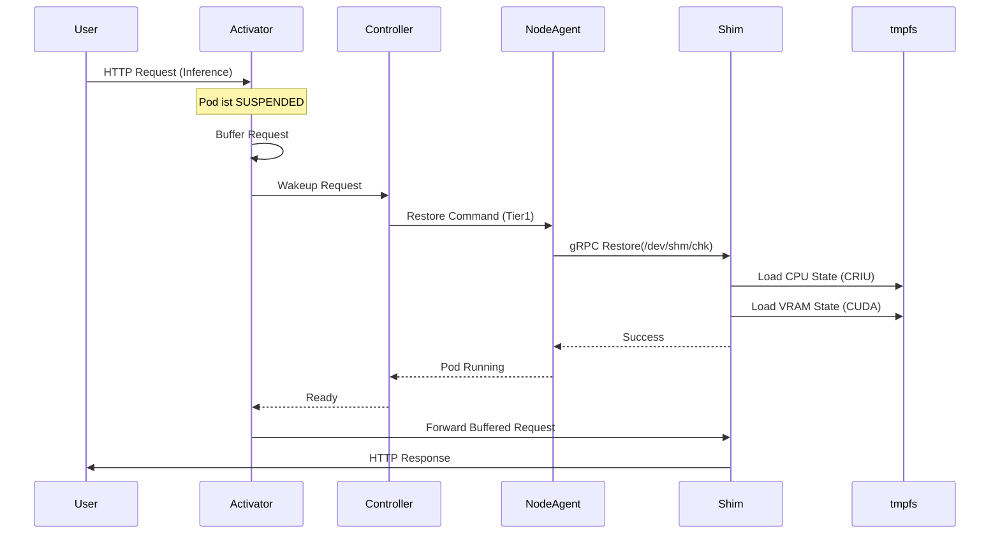

# Kybernate: Kubernetes Components & API Design

Dieses Dokument definiert die Kubernetes-Komponenten, Custom Resource Definitions (CRDs) und Schnittstellen, die für die Umsetzung der Kybernate-Plattform benötigt werden.

## 1. Custom Resource Definitions (CRDs)

Wir führen neue Ressourcen ein, um den Status von Checkpoints, Workloads und Policies deklarativ zu verwalten.

### 1.1. `GpuCheckpoint`
Repräsentiert einen eingefrorenen Zustand eines Workloads (CPU + GPU Memory).

```yaml
apiVersion: kybernate.io/v1alpha1
kind: GpuCheckpoint
metadata:
  name: qwen-72b-checkpoint-v1
  namespace: default
spec:
  sourcePod: qwen-72b-pod-xyz
  tier: "Tier1" # Ziel-Tier: Tier1 (RAM), Tier2 (NVMe), Tier3 (S3)
  keepAlive: false # false = Pod wird nach Checkpoint beendet/pausiert
status:
  phase: "Completed" # Pending, InProgress, Completed, Failed
  sizeBytes: 45000000000
  location: "/dev/shm/checkpoints/qwen-72b-v1" # Pfad oder S3 URL
  timestamp: "2025-12-01T12:00:00Z"
  conditions:
    - type: Ready
      status: "True"
```

### 1.2. `GpuWorkload`
Eine High-Level Abstraktion (Ersatz für Deployment/StatefulSet) für Checkpoint-aware Workloads.

```yaml
apiVersion: kybernate.io/v1alpha1
kind: GpuWorkload
metadata:
  name: qwen-service
spec:
  replicas: 1
  template:
    spec:
      runtimeClassName: kybernate # Verweist auf unseren Shim
      containers:
        - image: vllm/vllm-openai
          resources:
            limits:
              nvidia.com/gpu: 1
  policy:
    scaleToZero: true
    idleTimeoutSeconds: 300
    minTier: "Tier1" # Im Idle-Zustand mindestens im RAM halten (nicht auf Disk)
    multiplexingPriority: 100 # Priorität beim VRAM-Kampf (höher gewinnt)
```

### 1.3. `GpuRestoreJob` (Internal)
Wird vom Controller erstellt, um einen Restore-Vorgang auf einem spezifischen Node zu triggern.

```yaml
apiVersion: kybernate.io/v1alpha1
kind: GpuRestoreJob
metadata:
  name: restore-qwen-request-123
spec:
  checkpointRef: qwen-72b-checkpoint-v1
  targetNode: node-gpu-01
  targetPod: qwen-service-new-pod-abc
```

## 2. Controller Architektur (The Brain)

Der **Kybernate Controller** läuft als Deployment im Cluster und orchestriert das Gesamtsystem.

### 2.1. Reconciliation Loops

1.  **Workload Watcher**:
    *   Überwacht `GpuWorkload` Ressourcen.
    *   Erstellt die entsprechenden Pods.
    *   Konfiguriert den Activator (Proxy) für den Pod.

2.  **Metrics Watcher & Auto-Scaler**:
    *   Liest Metriken vom Activator (Requests/Sec) und Node-Agent (VRAM Usage).
    *   **Scale-Down**: Wenn `idleTimeout` erreicht -> Erstellt `GpuCheckpoint` (Suspend).
    *   **Scale-Up**: Wenn Request beim Activator aufläuft -> Trigger Restore.

3.  **Multiplexing Scheduler**:
    *   Entscheidet bei Ressourcenkonflikten.
    *   *Szenario*: Request für Modell B kommt rein, aber VRAM ist voll mit Modell A.
    *   *Aktion*:
        1.  Sende `Suspend` Befehl an Modell A (Prioritäts-Check).
        2.  Warte auf `GpuCheckpoint` Success von A.
        3.  Sende `Restore` Befehl für Modell B.

## 3. Node Agent & Shim Interface (The Muscle)

Da der K8s Controller nicht direkt mit dem Containerd-Shim sprechen kann, benötigen wir einen **Node Agent** (DaemonSet) auf jedem GPU-Node.

### 3.1. Node Agent (DaemonSet)
*   **Rolle**: Vermittler zwischen K8s API und lokalen Shims.
*   **Kommunikation**:
    *   Zum Controller: via K8s API (Status Updates) oder gRPC.
    *   Zum Shim: via Unix Domain Socket (`/run/kybernate/shim.sock`).

### 3.2. Shim API (gRPC)
Der Shim implementiert einen gRPC Server, den der Node Agent aufruft:

```protobuf
service ShimService {
  // Friert den Container ein und speichert State in Destination
  rpc Checkpoint(CheckpointRequest) returns (CheckpointResponse);
  
  // Stellt Container aus Source wieder her
  rpc Restore(RestoreRequest) returns (RestoreResponse);
  
  // Verschiebt Checkpoint von RAM -> Disk (Tiering)
  rpc MigrateStorage(MigrateRequest) returns (MigrateResponse);
}

message CheckpointRequest {
  string container_id = 1;
  string destination_path = 2; // z.B. /dev/shm/chk-123
  bool compress = 3;
}
```

### 3.3. Local Storage Manager
Eine logische Komponente (integriert in Node Agent oder Shim), die den physischen Speicher verwaltet.
*   **Aufgabe**: Verwaltet `tmpfs` (Tier 1) und lokale NVMe-Pfade (Tier 2).
*   **Tiering-Logik**: Führt das Verschieben von Checkpoints zwischen RAM und Disk durch, wenn der `MigrateStorage` RPC aufgerufen wird.
*   **Cleanup**: Löscht verwaiste Checkpoints oder gibt Speicher frei, wenn die `GpuCheckpoint` CRD gelöscht wird.

## 4. Der Activator (Smart Proxy)

Der Activator stellt sicher, dass Requests nicht ins Leere laufen, während der Pod schläft.

*   **Deployment**: Als Sidecar im Pod oder als zentrales Gateway pro Node.
*   **Funktionsweise**:
    1.  **Active State**: Leitet TCP Traffic 1:1 an `localhost:8000` (vLLM) weiter.
    2.  **Idle State**: Lauscht auf Port, hält Verbindung offen, aber sendet nichts an Container.
    3.  **On Request**:
        *   Puffert das erste Datenpaket (HTTP Header).
        *   Ruft Webhook am Controller: `POST /wakeup {pod: "qwen-xyz"}`.
        *   Wartet, bis Controller "Ready" signalisiert.
        *   Leitet gepufferten Traffic weiter.

## 5. Sequenzdiagramm: "Warm Start"



## 6. Zusammenfassung der Architektur

1.  **User** interagiert mit **Activator** (transparent).
2.  **Activator** weckt **Controller**.
3.  **Controller** orchestriert Ressourcen (wer darf in den VRAM?).
4.  **Node Agent** führt Befehle lokal aus.
5.  **Shim** macht die harte Arbeit (`criu`, `cuda-checkpoint`).

Diese Architektur entkoppelt die Logik sauber: Der Shim muss nichts von Kubernetes wissen, und Kubernetes muss nichts von CUDA-Details wissen. Der Node Agent ist das Bindeglied.
